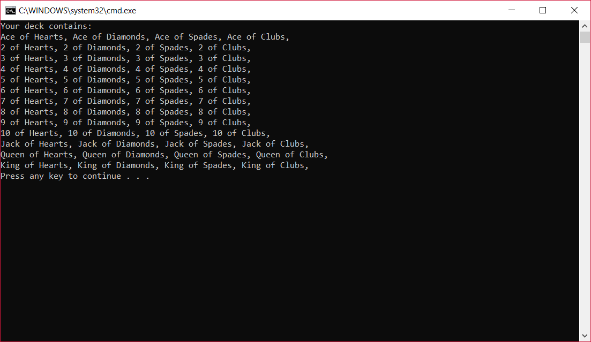
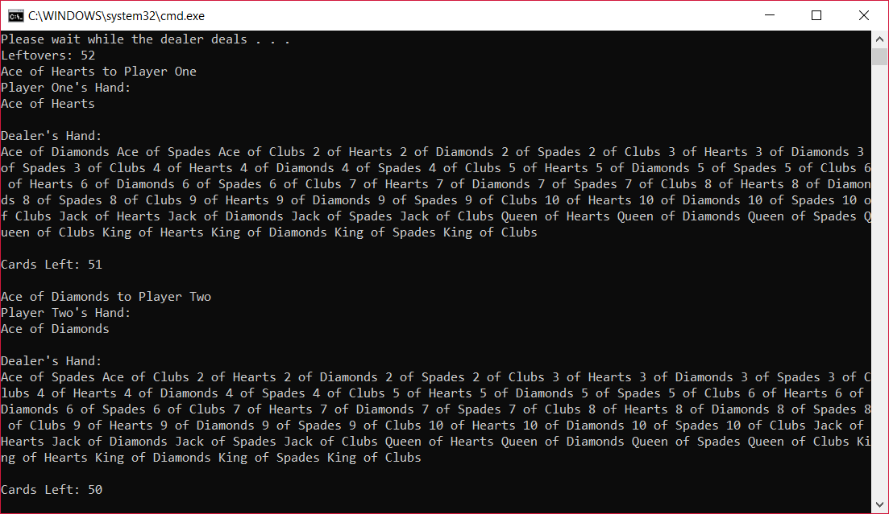
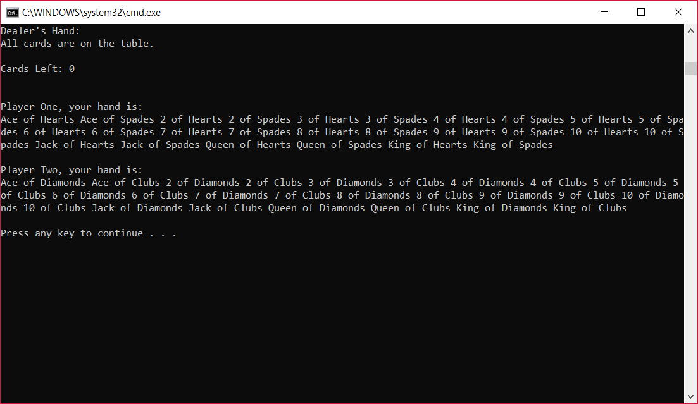

# LAB07-COLLECTIONS

## Description

Let's play some cards! Run this application and watch as a full deck of 52 playing cards is built and dealt right before your eyes. The dealer will keep track of both players' hands and also hold onto any leftover cards, should there be an uneven number of players at anytime.

## How to Play

All you need to do is open the application and the dealer takes care of the rest.

## Concepts Utilized

- Generic containers
- Custom classes
- Custom methods

## Demos

### Build a Deck:

### Deal Players' Hands
#### On Start:

#### Complete:

## Thank You!
